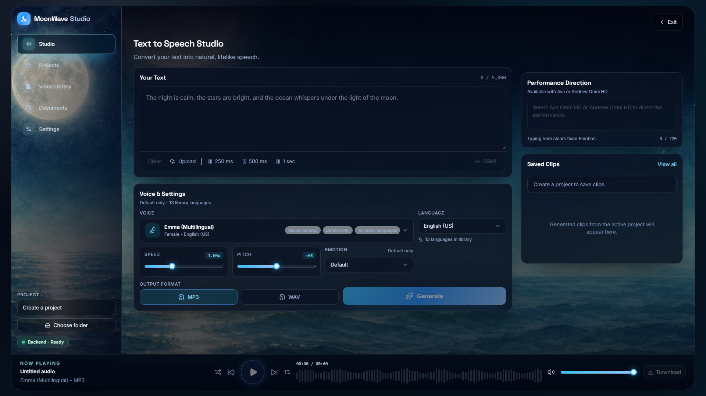

# MoonWave Studio



MoonWave Studio turns text into natural-sounding voice clips with Azure AI Speech.

Your Azure Speech key is never typed into the browser. It stays in your private backend settings.

## Start Here

Follow these steps in order.

## 1. Install What You Need

Install these first:

- [Node.js](https://nodejs.org/) 20 or newer
- [Git](https://git-scm.com/)
- An Azure account
- An Azure AI Speech resource

If you want to run the backend on your computer, also install:

- [Azure Functions Core Tools v4](https://learn.microsoft.com/en-us/azure/azure-functions/functions-run-local)

If you do not install Azure Functions Core Tools, you can still use MoonWave, but you must deploy the backend to Azure first.

## 2. Create Your Azure Speech Resource

1. Go to the [Azure portal](https://portal.azure.com/).
2. Create an Azure AI Speech resource.
3. Open the resource.
4. Go to **Keys and Endpoint**.
5. Copy one key.
6. Copy the region, such as `eastus`.

You will use these values later:

```text
AZURE_SPEECH_KEY
AZURE_SPEECH_REGION
```

Never upload your real Azure key to GitHub.

## 3. Download MoonWave

Clone the repo:

```sh
git clone https://github.com/LFxG1/MoonWave-TTS.git
cd MoonWave-TTS
```

Or download the ZIP from GitHub and open the project folder on your computer.

## 4. Install Project Packages

Run this in the project folder:

```sh
npm install
```

## 5. Create Your Private Settings File

Find this file:

```text
local.settings.example.json
```

Make a copy of it and rename the copy to:

```text
local.settings.json
```

Open `local.settings.json` and fill in your Azure Speech key and region:

```json
{
  "IsEncrypted": false,
  "Values": {
    "AzureWebJobsStorage": "UseDevelopmentStorage=true",
    "FUNCTIONS_WORKER_RUNTIME": "node",
    "AZURE_SPEECH_KEY": "paste-your-key-here",
    "AZURE_SPEECH_REGION": "eastus",
    "ALLOWED_ORIGIN": "http://localhost:5173,http://127.0.0.1:5173"
  }
}
```

Keep `local.settings.json` private. Git ignores this file on purpose.

## 6. Start The Backend

Run this in one terminal:

```sh
npm run api:start
```

Leave that terminal open.

The backend runs at:

```text
http://localhost:7071/api
```

If you see `func is not recognized`, Azure Functions Core Tools is missing. Install Azure Functions Core Tools v4, close your terminal, reopen it, and try again.

You can check the install with:

```sh
func --version
```

## 7. Start The App

Open a second terminal in the project folder.

Run:

```sh
npm run dev
```

Open:

```text
http://localhost:5173
```

During local development, MoonWave automatically sends `/api` requests to the local backend at `http://127.0.0.1:7071`.

## 8. Test It

1. Open MoonWave in your browser.
2. Go to **Settings**.
3. Confirm the backend says ready.
4. Go to **Text to Speech**.
5. Type text and generate a voice clip.

## If You Do Not Install Azure Functions Core Tools

The frontend can still run, but the local backend cannot.

Use this path instead:

1. Deploy the Azure Function backend to Azure.
2. Add these settings to the Azure Function App:

```text
AZURE_SPEECH_KEY
AZURE_SPEECH_REGION
ALLOWED_ORIGIN
```

3. Create a file named `.env.local` in the project folder:

```env
VITE_TTS_API_BASE_URL=https://your-function-app.azurewebsites.net/api
```

4. Start the frontend:

```sh
npm run dev
```

In this setup, your computer runs the browser app and Azure runs the backend.

## What MoonWave Does

- Converts text into speech with Azure AI Speech.
- Lets you choose voices, styles, speed, pitch, emotions, and output format.
- Saves generated audio into normal project folders on your computer.
- Keeps Azure credentials out of browser storage.

Project folders are saved like this:

```text
Your chosen folder/
  Project Name/
    project.json
    clips/
      voice-clip.mp3
      voice-clip.ssml
      voice-clip.json
```

## Deploy Your Own Copy

Each person should deploy their own backend and use their own Azure Speech resource.

Do not share one public backend unless you add login, rate limits, abuse protection, and billing controls.

### Deploy The Backend

Create an Azure Function App in Azure, then deploy this repo's Function backend.

You can deploy with:

- The Azure Functions extension in Visual Studio Code
- Azure Functions Core Tools from the terminal
- Your normal Azure deployment workflow

After deployment, add these Function App settings in Azure:

```text
AZURE_SPEECH_KEY
AZURE_SPEECH_REGION
ALLOWED_ORIGIN
```

Set `ALLOWED_ORIGIN` to the website where your frontend is hosted, for example:

```text
https://your-site-name.netlify.app
```

### Deploy The Frontend

Set this environment variable in your frontend host:

```text
VITE_TTS_API_BASE_URL=https://your-function-app.azurewebsites.net/api
```

Then build:

```sh
npm run build
```

The production files are created in `dist/`.

If your frontend and backend are hosted under the same domain and `/api` routes to the Azure Function, you can skip `VITE_TTS_API_BASE_URL`. MoonWave defaults to `/api`.

## Useful Commands

```sh
npm install
npm run api:start
npm run dev
npm test
npm run build
npm run preview
```

## Troubleshooting

### Backend Does Not Say Ready

Check that the backend is running:

```text
http://localhost:7071/api/health
```

If that page does not load, restart the backend:

```sh
npm run api:start
```

### `func` Is Not Recognized

Install Azure Functions Core Tools v4, close your terminal, reopen it, and run:

```sh
func --version
```

If that command works, try:

```sh
npm run api:start
```

### Text To Speech Does Not Work

Check that:

- `local.settings.json` exists
- `AZURE_SPEECH_KEY` is filled in
- `AZURE_SPEECH_REGION` is filled in
- The backend terminal is still running
- The frontend terminal is still running

### Project Folder Saving Is Unavailable

Use Chrome or Edge. MoonWave uses the File System Access API for project folders, and not every browser supports it.

### Is My Azure Key Safe?

Yes, as long as you keep it in `local.settings.json` locally or Azure Function App settings in production.

Do not put your Azure key in browser settings, screenshots, GitHub issues, commits, or README files.

## Safe GitHub Checklist

Before pushing your own copy to GitHub:

- Commit `local.settings.example.json`.
- Do not commit `local.settings.json`.
- Do not commit `.env` files.
- Do not commit generated audio unless you intentionally want it public.
- Do not paste your Azure key into code, screenshots, issues, commits, or docs.

## Tech Stack

- React
- Vite
- Azure Functions
- Azure Speech REST API
- Tailwind CSS
- Framer Motion
- lucide-react

## Official References

- [Azure Functions Core Tools](https://learn.microsoft.com/en-us/azure/azure-functions/functions-run-local)
- [Deploy Azure Functions from Visual Studio Code](https://learn.microsoft.com/en-us/azure/azure-functions/how-to-create-function-vs-code)
- [Azure Speech REST text-to-speech](https://learn.microsoft.com/en-us/azure/ai-services/speech-service/rest-text-to-speech)
- [Azure Speech regions](https://learn.microsoft.com/en-us/azure/ai-services/speech-service/regions)
